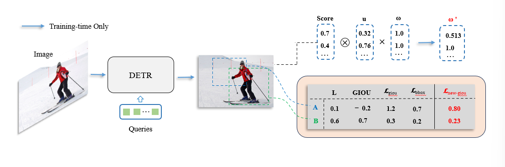

# SL-DETR: Universal synchronization loss optimization in DETR-based oriented and rotated object detection
### Yu Qingchen

## Introduction
we propose universal synchronization loss. It can associate different positioning losses to improve detection accuracy. Specifically, we introduce L1 distance on the
oriented object detection dataset and control the GIOU loss through a function. On the rotated dataset, we introduce L1 distance to control the Kullback-Leibler
divergence loss. In addition, we propose a method to dynamically adjust the classification weights to further associate the relationship between classification
loss and localization loss. Experimental results on the COCO and DOTA v1.0/v1.5/v2.0 dataset demonstrate that our proposed universal synchronization
loss brings excellent performance, surpassing previous DETR models and other similar models. This work underscores the importance of synchronizing losses
in improving the overall optimization and detection accuracy of DETR-based models.

## Usage 📖
Oriented object detection Example:
Our code is in LG-DETR ([README.md](LG-DETR%2FLGDETR%2FREADME.md))

Rotated  object detection Example:
Our code is in SL-DETR ([README.md](SL-DETR%2FREADME.md))

## Citation

If you are interested in our work and use our method in your research, please cite
